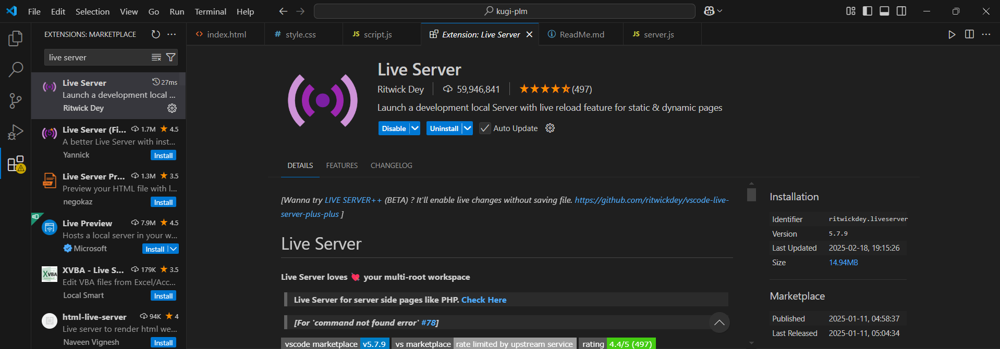
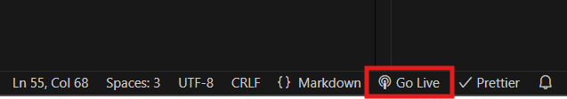

# Kugi-plm

## Overview

The application requires API access, but due to Cross-Origin Resource Sharing (CORS) restrictions, a CORS proxy has been set up to handle API requests locally.

## Prerequisites

Before running the application, ensure you have the following installed:

- [Node.js](https://nodejs.org/)
- Web browser (Chrome, Firefox, Edge, etc.)
- (Optional) A local server like `Live Server` for better development experience

## Setting Up the CORS Proxy

To bypass CORS issues and allow API requests, follow these steps:

1. Clone this repository:

   ```sh
   git clone https://github.com/tetsukin2/kugi-plm.git
   ```

2. Navigate to the CORS proxy directory (if separate):

   ```sh
   cd cors-proxy
   ```

3. Install dependencies (if applicable):

   ```sh
   npm install
   ```

4. Start the CORS proxy server:

   ```sh
   node server.js
   ```

   This should start the proxy on a specified port (e.g., `http://localhost:8080`). Ensure the application is configured to use this proxy for API requests.

## Running the Application

To run the application, follow these steps:

1. Open the project directory in a terminal.
2. Start the proxy server, This is a necessary requirement to run the application:
3. 
   ```sh
   cd cors-proxy
   node server.js
   ```
   
4. Start the application:

   - If using `Live Server` (downloaded through VS Code extension):
     
     

   - right-click `index.html` and select **Open with Live Server** or Click "Go Live" in the bottom right of the VS Code.
     
     


5. Open `index.html` in your browser manually if no server is used.

## Configuration

If needed, fetch can be edited in script.js.
simply change the proxy Url:

```js
const proxyUrl = "http://localhost:8080/proxy?url=";
```

To match with your localhost port. This is to bypass CORS-POLICY and access the API.
